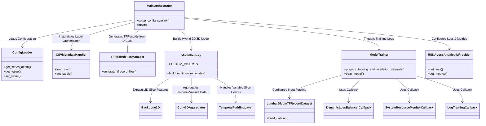

# RSNA 2024 Lumbar Spine Degenerative Classification

This repository hosts a modular, production-ready Deep Learning pipeline built with **TensorFlow / tf_keras** for the RSNA 2024 Lumbar Spine Degenerative Classification challenge. The goal is to detect and classify the severity of lumbar spine degenerative conditions (e.g., neural foraminal narrowing, canal stenosis, subarticular stenosis) and predict coordinate locations for medical annotations from volumetric DICOM imaging data.

The architecture uses a hybrid model: extracting 2D features from series slice images using modern backbones (e.g., MobileNetV2, ResNet50) and aggregating these features into a 3D context using convolutional temporal aggregation layer networks.

---

## 📂 Project Directory Structure

Below is the directory structure for the project, showcasing the separation between data management, models, callbacks, utility functions, scripts, and tests.

```mermaid
graph TD
    Root[RSNA_Items_Detection_Classification] --> Src[src]
    Root --> Scripts[scripts]
    Root --> Test[test]
    Root --> Data[data]
    Root --> Logs[logs]
    
    Src --> SrcMain["RSNA_2024_Lumbar_Spine_Degenerative_Classification.py (Entry point)"]
    Src --> SrcSurvey["RSNA_input_data_survey.py (DICOM inspection)"]
    Src --> Config[config]
    Src --> Core[core]
    Src --> Projects[projects]
    
    Config --> ConfigLoader[config_loader.py]
    Config --> Schema[schema.py]
    Config --> ConfigYAMLs[lumbar_spine_config_windows/kaggle.yaml]
    
    Core --> Models[models]
    Core --> Callbacks[callbacks]
    Core --> Utils[utils]
    
    Models --> ModelFactory[model_factory.py]
    Models --> Backbone2D[backbone_2d.py]
    Models --> Conv3DAgg[conv3d_aggregator.py]
    Models --> TempPadding[temporal_padding_layer.py]
    
    Callbacks --> ResourceMon[system_resource_monitor_callback.py]
    Callbacks --> LossBal[dynamic_loss_balancer_callback.py]
    Callbacks --> LogTrain[log_training_callback.py]
    
    Utils --> DatasetUtils[dataset_utils.py]
    Utils --> LoggerUtils[logger.py]
    Utils --> StreamTee[system_stream_tee.py]
    
    Projects --> Lumbar[lumbar_spine]
    Lumbar --> Trainer[model_trainer.py]
    Lumbar --> TFRecordMgr[tfrecord_files_manager.py]
    Lumbar --> CSVHandler[csv_metadata_handler.py]
    Lumbar --> DatasetPipe[lumbar_dicom_tfrecord_dataset.py]
    Lumbar --> Losses[RSNA_lumbar_losses_and_metric.py]
```



---

## 🏗️ Software Architecture & Design Patterns

The pipeline is organized around modular objects with single responsibilities. The main training entry point orchestrates these modules.



---

## 🛠️ Key Engine Features

### ⚖️ Dynamic Loss Balancing
Because classification (weighted log loss) and coordinate regression (MSE) have different magnitudes, the model uses a custom `DynamicLossBalancerCallback`. This callback dynamically adjusts the `location_output` loss weight variable based on the relative convergence rates of both tasks across epochs.

### 🛡️ OOM Prevention Circuit
Processing large volumetric 3D datasets in batches can cause Out-Of-Memory (OOM) errors. The `SystemResourceMonitorCallback` actively monitors RAM/CPU usage at the end of each batch/epoch and triggers a graceful emergency training stop if memory exceeds the threshold configured in the YAML (e.g. `90%`). This ensures that checkpoints are saved before an OOM occurs.

### 🔄 Fail-Safe Resume Logic
If a training run is interrupted, the entry point attempts to load the complete saved Keras model. In case loading fails (e.g. serialization issues with custom Keras Layers), a weight salvage fallback builds a fresh architecture from the `ModelFactory` and maps the saved weights by name before continuing.

---

## 🚀 Getting Started

### 1. Environment and Symlinks
The pipeline utilizes symlinks to select configurations depending on the environment (Kaggle kernel vs local Windows machine). 

Create a hardlink/symlink to point to the correct configuration:
```powershell
# PowerShell script to create links
.\scripts\create_hardlink.ps1
```

### 2. Surveying Dataset
Inspect your input raw DICOM files to check spacing, image formats, and depths before starting preprocessing:
```bash
python src/RSNA_input_data_survey.py
```

### 3. Running Training
Start the end-to-end pipeline (Preprocessing -> TFRecord generation -> Training -> Evaluation):
```powershell
# Directly using PowerShell script:
.\scripts\run_pipeline.ps1

# Or running the python script manually:
python src/RSNA_2024_Lumbar_Spine_Degenerative_Classification.py
```

---

## 🧪 Tests
The repository is fully testable using `pytest`. The `test/` directory contains unit tests for utils, models, dataset loaders, as well as full integration tests verifying data flows.

Run the test suite:
```bash
pytest
```